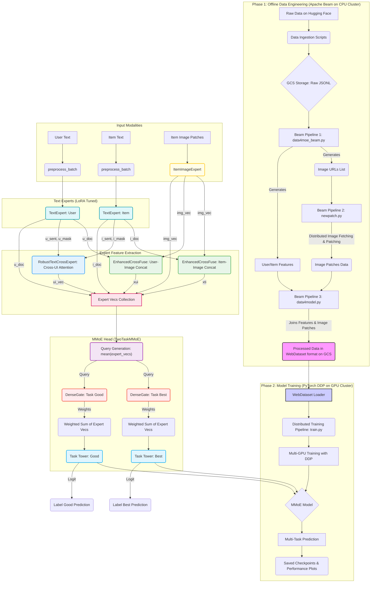

<div align="center">
    <p>
        <a href="#zh-cn">中文版</a> | <a href="#en">English</a>
    </p>
</div>

<div id="zh-cn">

# 端到端多模态MMoE推荐系统

[](https://www.python.org/downloads/)
[](https://pytorch.org/)
[](https://beam.apache.org/)
[](https://opensource.org/licenses/MIT)
[](https://github.com/JingxiangQU/mmoe-multimodal-rec)
[](https://huggingface.co/datasets/jingxiang11111/amazon_reviews_for_rec)
[](https://huggingface.co/jingxiang11111/mmoe-multimodal-rec)
> 本项目是基于 Apache Beam 和 PyTorch DDP 构建的，从原始数据到模型训练的端到端多模态推荐系统。项目包括分布式特征工程、高效数据加载、复杂模型（MMoE）的分布式训练与微调。
> 结果展示：


-**结果分析**
> ### **结果分析**
> * 在**22,281条**独立验证集样本上进行评估，取得了卓越的性能：
>     * **AUC for 'good' task: 0.938**
>     * **AUC for 'best' task: 0.926**
> * 在`data4moe_beam.py`中，通过`SplitByDate`模块严格按照时间序（训练集 ≤ 2023.6.30 < 验证集 ≤ 2023.9.30）划分数据集，有效防止了数据穿越，确保了评估结果的公正性。

## 数据集和模型

本项目所用的**数据集**和**训练好的模型**均已在 Hugging Face Hub 上开源，方便社区进行复现和进一步研究。
* **备注**： 由于文件数量过多，从runpod平台上传文件到hugging face时被rate limit导致大量文件上传失败，会尽快解决。

* **数据集 (Amazon Reviews for Recommendation)**: 包含了用于处理后的用于训练的数据用于验证的数据。
    [前往 Hugging Face 数据集](https://huggingface.co/datasets/jingxiang11111/amazon_reviews_for_rec)

* **模型 (MMoE Multimodal Recommender)**: 训练好的 MMoE 模型文件。
    [前往 Hugging Face 模型](https://huggingface.co/jingxiang11111/mmoe-multimodal-rec)


---

## 核心特性

- **端到端全流程**: 覆盖从数据拉取、处理到模型训练的完整闭环。
- **可拓展架构**: 特征工程与模型训练完全解耦，提高系统可扩展性。
- **高性能数据管道**: 使用 WebDataset 存储，解决云存储环境下的I/O瓶颈。
- **先进模型架构**: 实现复杂的多任务专家混合模型 (MMoE)。
- **高效分布式训练**: 使用 PyTorch DistributedDataParallel (DDP) 训练。

---

## 系统架构

本项目的核心设计思想是将整个推荐流程拆分为两个独立但衔接的阶段：**离线特征工程** 和 **模型训练**。


---

## 特征工程效果展示

以下是一个从Beam流水线中生成的真实用户画像样本：

```json
{
  "user_id": "USER_EXAMPLE_ID",
  "user_feat": {
    "cat_hist": {
      "All Electronics": 0.14,
      "Tools & Home Improvement": 0.43,
      "Sports & Outdoors": 0.14
    },
    "review_cnt": 7,
    "price_mean": 25.59,
    "price_std": 25.5,
    "history": [
      {
        "title": "Do not buy...did not work, will not hold a charge.",
        "text": "Purchased in Dec, first charge to full capacity before use mid January in Makita charger that came with drill. Neither battery held a sufficient charge to be useful..."
      },
      {
        "title": "20 amp 250v plug",
        "text": "Sometimes hard to find this 20 amp 250v plug was just what ai needed and I found it on Amazon. Superior Electric had it to me in good time at a fair price."
      }
    ]
  }
}
```

### 亮点解读 (Key Insights)

- **为句级交叉注意力赋能**: 特征工程中有意识地将用户多条历史评论整合成完整文本段落。
- **精准分句作为桥梁**: 模型训练预处理阶段精准切分文本段落成句子，实现细粒度语义理解。
- **实现深度语义交互**: 句向量序列被送入交叉注意力模块，实现用户历史兴趣和物品描述间的深度语义交互。

---
## 项目结构

```text
.
├── data4moe_beam.py     # 主特征工程脚本 (Beam)，生成用户/物品特征和图片URL列表， 按照日期划分train/valid/test，严防特征穿越
├── newpatch.py          # 分布式图片处理脚本 (Beam)，将URL转换为图像patch数据
├── data4model.py        # 合并所有特征并生成WebDataset的脚本 (Beam)
├── meta2gcs.py          # 从Hugging Face下载元数据的辅助脚本
├── review2gcs.py        # 从Hugging Face下载评论数据的辅助脚本
├── model.py             # 定义所有PyTorch模型架构 (MMoE, Experts)
├── train.py             # 核心模型训练脚本 (PyTorch DDP)
├── inference_and_auc.py # 推理脚本，并计算auc
├── requirements.txt     # 项目依赖
└── README.md            # 本文档
```
---
## 环境安装

```shell
git clone [你的仓库URL]
cd [你的仓库目录]

conda create -n mmoe_rec python=3.11
conda activate mmoe_rec

pip install -r requirements.txt

python -c "import nltk; nltk.download('punkt'); nltk.download('punkt_tab')"
```

---

## 如何运行

### 数据准备

```shell
python meta2gcs.py --bucket [你的GCS桶名称]
python review2gcs.py --bucket [你的GCS桶名称]

python data4moe_beam.py --[相关参数]
python newpatch.py --[相关参数]
python data4model.py --output_dir gs://[你的GCS路径]
```

### 模型训练

```shell
export TOKENIZERS_PARALLELISM=false

torchrun --nproc_per_node=2 train.py \
  --model_name BAAI/bge-base-en-v1.5 \
  --img_model google/vit-base-patch16-224-in21k \
  --data_pattern '/path/to/your/local/wds_shards/data-*-*.tar.gz' \
  --batch_size 128 \
  --grad_accum 8 \
  --epochs 4 \
  --num_workers 32 \
  --lora_r 8 \
  --lr 1e-5 \
  --output_dir /workspace/outputs
```

---

### 推理
```shell

python inference_and_auc.py \
  --data_pattern 'valid/data-*-*.tar.gz' \
  --checkpoint_path './outputs/ckpt_epoch3.pt' \
  --output_dir './outputs' \
  --model_name BAAI/bge-base-en-v1.5 \
  --img_model google/vit-base-patch16-224-in21k \
  --batch_size 256 \
  --num_workers 8 \
  --lora_r 8
```

---

## 性能优化与成果

- **解决I/O瓶颈**: 早期实验发现，直接从GCS流式读取数据导致严重的I/O瓶颈，GPU利用率极低。通过将数据预先下载到本地磁盘，彻底解决了该问题。
- **优化CPU预处理**: spaCy分词器成为新的CPU瓶颈。通过替换为轻量级的NLTK分词器，数据预处理速度提升了超过50倍，显著提高了GPU的平均利用率。
- **精细化显存管理**: 在LoRA微调解冻时遇到了反复的CUDA OOM问题。通过系统性地下调batch_size、增加梯度累积步数、限制max_tok，最终找到了一个可以在80GB显存内稳定运行的最佳配置，实现了高达91%的显存利用率。


---
## 训练结果


- **注**：共4个epoch，图2中每个epoch重复计数了一次，已定位问题并在`train.py`中修改。
  
---

### 现有不足

-   **loss曲线没有稳定下降**: 当前的训练损失曲线并未呈现理想的稳定下降趋势。初步诊断和行动计划如下：
    * **初步分析**:
        * **学习率问题**: 当前学习率（如1e-5）可能相对较高，导致优化过程在最优解附近震荡或直接跳过。
        * **Warmup与Gate稳定性**: 初始化参数的Warmup步数可能不足，导致LoRA微调启动时，MMoE的Gate权重尚未收敛，对专家的选择仍处于不稳定状态，影响模型学习。
        * **脏数据干扰**: 训练数据中未能成功抓取图片的样本被处理为“全零图片”，这部分无效样本的占比较高，可能导致模型学到的是噪声而非有效特征，从而产生梯度扰动。
        * **数据流与收敛性**: 在每个epoch都引入未学习过的新样本的训练模式下，模型可能需要更多的训练步数才能在庞大的数据空间上达到充分收敛。

    * **行动计划与实验设计**: 针对以上四个潜在问题，已规划三组并行的对照实验进行定位和验证
        * **实验A（学习率和Warmup）**: 固定其他条件，测试三组学习率（1e-5, 5e-6, 1e-6）和两组Warmup步数（1000, 3000）的组合。同时，将记录Gate层输出的熵（entropy）或标准差（standard deviation）作为其稳定性的量化监控指标。
        * **实验B（脏数据分析）**: 修改`model.py`中的数据加载逻辑，精确统计并打印每个epoch中“全零图片”样本的占比。若比例显著（如 > 5%），则优先修复`newpatch.py`中的图片获取和处理逻辑；反之则暂时搁置此问题。
        * **实验C（收敛性分析）**: 保持现有训练策略，但将总训练步数延长50%，并以更细的粒度在独立的验证集上记录AUC指标的变化。通过绘制更长的学习曲线，判断模型是否存在持续收敛的潜力，并评估当前训练步数是否充足。

-   **数据清洗逻辑有待加强**: 当前在`data4model.py`中的`normalize_text`函数虽然实现了一些基础的文本规范化，但对于真实世界中更为嘈杂和非结构化的文本（如俚语、拼写错误、特殊符号等）处理能力有限，逻辑有待进一步加强。

-   **特征拼接方式相对简单**: `data4model.py`中的`build_user_text`和`build_item_text`函数将多源特征直接拼接成一个长字符串。没有考虑特征间的结构化信息，增加了模型从纯文本中分离和理解不同语义信息的负担。

-   **训练中缺失AUC评估**: `train.py`脚本中，由于样本量巨大，在每个step后计算AUC耗时过长，因此当前的训练脚本中并未包含在线的AUC计算。 这导致训练过程中无法实时监控模型的泛化能力。下一步计划是在独立的验证集上进行完整的离线AUC评测（优先度最高）。UPDATE：-**已解决**

### 未来工作方向

-   **离线特征预处理**: 将分词和Tokenizer编码等CPU密集型任务完全离线化，将最终的Token ID存为二进制文件，进一步压榨数据加载性能，让GPU利用率达到极致。
-   **流式处理**: 思考如何将Beam流水线从批处理模式切换到流处理模式，对接实时用户行为数据流，实现准实时的特征更新和模型训练。
-   **模型架构探索**: 尝试更复杂的交叉注意力结构，以更好地捕捉多模态特征间的细粒度交互; 在MMoE中引入稀疏门控机制（Top-K Gating）。 受到近期前沿研究（如DeepSeek-V3的LFBias）的启发，未来可以探索更先进的负载均衡策略，以确保稀疏门控下各个专家的均衡利用，防止模型退化。


</div>

<div id="en">


# End-to-End Multimodal Recommendation System

[](https://www.python.org/downloads/) [](https://pytorch.org/) [](https://beam.apache.org/) [](https://opensource.org/licenses/MIT)
[](https://github.com/JingxiangQU/mmoe-multimodal-rec)
[](https://huggingface.co/datasets/jingxiang11111/amazon_reviews_for_rec)
[](https://huggingface.co/jingxiang11111/mmoe-multimodal-rec)

> This project is an end-to-end multimodal recommendation system built with Apache Beam and PyTorch DDP, covering the entire pipeline from raw data to model training. It includes distributed feature engineering, efficient data loading, and distributed training/fine-tuning of a complex Mixture-of-Experts (MMoE) model.
>
> **Results:**
> 
>  
>
> ---
> ### **Result Analysis**
> * Achieved excellent performance on an independent validation set of **22,281 samples**:
>     * **AUC for 'good' task: 0.938**
>     * **AUC for 'best' task: 0.926**
> * The dataset was strictly split by timestamp (train ≤ 2023-06-30 < valid ≤ 2023-09-30) in the `SplitByDate` module of `data4moe_beam.py` to prevent data leakage and ensure a fair evaluation.

---

## Dataset and Model

The **dataset** and **pre-trained model** used in this project are open-sourced on the Hugging Face Hub to facilitate reproducibility and further research.

* **Dataset (Amazon Reviews for Recommendation)**: Contains the processed data for training and validation.
    [Go to Hugging Face Dataset](https://huggingface.co/datasets/jingxiang11111/amazon_reviews_for_rec)

* **Model (MMoE Multimodal Recommender)**: The trained MMoE model files.
    [Go to Hugging Face Model](https://huggingface.co/jingxiang11111/mmoe-multimodal-rec)
    
* **Note**: Due to rate limits during the upload from the cloud platform, some files may be missing. This will be fixed soon.

---

## Core Features

-   **End-to-End Pipeline**: Covers the complete loop from data ingestion and processing to model training and evaluation.
-   **Scalable Architecture**: Decouples feature engineering from model training for enhanced system scalability.
-   **High-Performance Data Pipeline**: Uses WebDataset to address I/O bottlenecks in cloud storage environments.
-   **Advanced Model Architecture**: Implements a complex Multi-gate Mixture-of-Experts (MMoE) model for multi-task learning.
-   **Efficient Distributed Training**: Employs PyTorch DistributedDataParallel (DDP) for multi-GPU training.

---

## System Architecture

The core design philosophy is to separate the entire recommendation workflow into two independent yet connected stages: **Offline Feature Engineering** and **Model Training**.


---

## Feature Engineering Showcase

Below is a sample user profile generated from the Beam pipeline:

```json
{
  "user_id": "USER_EXAMPLE_ID",
  "user_feat": {
    "cat_hist": {
      "All Electronics": 0.14,
      "Tools & Home Improvement": 0.43,
      "Sports & Outdoors": 0.14
    },
    "review_cnt": 7,
    "price_mean": 25.59,
    "price_std": 25.5,
    "history": [
      {
        "title": "Do not buy...did not work, will not hold a charge.",
        "text": "Purchased in Dec, first charge to full capacity before use mid January in Makita charger that came with drill. Neither battery held a sufficient charge to be useful..."
      },
      {
        "title": "20 amp 250v plug",
        "text": "Sometimes hard to find this 20 amp 250v plug was just what ai needed and I found it on Amazon. Superior Electric had it to me in good time at a fair price."
      }
    ]
  }
}
```
### Key Insights

- **Enabling Sentence-Level Cross-Attention**: User historical reviews are deliberately aggregated into complete text paragraphs during feature engineering.
- **Precise Sentence Splitting as a Bridge**: The text paragraphs are accurately split into sentences during the model preprocessing stage to enable fine-grained semantic understanding.
- **Achieving Deep Semantic Interaction**: The resulting sentence vector sequences are fed into a cross-attention module to achieve deep semantic interaction between user historical interests and item descriptions.

---
## Project Structure

```text
.
├── data4moe_beam.py     # Main feature engineering script (Beam), prevents data leakage
├── newpatch.py          # Distributed image processing script (Beam)
├── data4model.py        # Script to merge features and generate WebDataset
├── meta2gcs.py          # Helper script to download metadata
├── review2gcs.py        # Helper script to download review data
├── model.py             # Defines all PyTorch model architectures (MMoE, Experts)
├── train.py             # Core model training script (PyTorch DDP)
├── inference_and_auc.py # Inference script to calculate AUC and plot ROC curves
├── requirements.txt     # Project dependencies
└── README.md            # This document
```
---
## Environment Setup

```shell
git clone [https://github.com/JingxiangQU/mmoe-multimodal-rec.git](https://github.com/JingxiangQU/mmoe-multimodal-rec.git)
cd mmoe-multimodal-rec

# Recommended to use conda
conda create -n mmoe_rec python=3.11
conda activate mmoe_rec

pip install -r requirements.txt

# Download NLTK sentence tokenizer model
python -c "import nltk; nltk.download('punkt');"
```

---

## How to Run

### Data Preparation

```shell
# 1. Download raw data (requires Hugging Face Token environment variable)
python meta2gcs.py --bucket [YOUR_GCS_BUCKET_NAME]
python review2gcs.py --bucket [YOUR_GCS_BUCKET_NAME]

# 2. Run Beam data processing pipelines
python data4moe_beam.py --[RELEVANT_ARGS]
python newpatch.py --[RELEVANT_ARGS]
python data4model.py --output_dir gs://[YOUR_GCS_PATH]
```

### Model Training

```shell
export TOKENIZERS_PARALLELISM=false

torchrun --nproc_per_node=2 train.py \
  --model_name BAAI/bge-base-en-v1.5 \
  --img_model google/vit-base-patch16-224-in21k \
  --data_pattern '/path/to/your/local/wds_shards/data-*-*.tar.gz' \
  --batch_size 128 \
  --grad_accum 8 \
  --epochs 4 \
  --num_workers 32 \
  --lora_r 8 \
  --lr 1e-5 \
  --output_dir /workspace/outputs
```

---

### Inference & Evaluation
```shell

python inference_and_auc.py \
  --data_pattern 'valid/data-*-*.tar.gz' \
  --checkpoint_path './outputs/ckpt_epoch3.pt' \
  --output_dir './outputs' \
  --model_name BAAI/bge-base-en-v1.5 \
  --img_model google/vit-base-patch16-224-in21k \
  --batch_size 256 \
  --num_workers 8 \
  --lora_r 8
```

---

## Performance Optimization & Achievements


-   **Solved I/O Bottleneck**: Initial experiments showed that streaming data directly from GCS caused severe I/O bottlenecks, leading to extremely low GPU utilization. This was resolved by pre-downloading the data to local disk.
-   **Optimized CPU Preprocessing**: The spaCy tokenizer became the new CPU bottleneck. By replacing it with the lightweight NLTK tokenizer, data preprocessing speed was improved by over 50x, significantly increasing average GPU utilization.
-   **Fine-tuned Memory Management**: Encountered recurrent CUDA OOM issues when unfreezing LoRA layers. A stable configuration that runs within 80GB of VRAM was found by systematically reducing `batch_size`, increasing gradient accumulation steps, and limiting `max_tok`, achieving up to 91% VRAM utilization.


---
## Training Results


- **Note**：The plotting logic for Figure 2 had a bug that caused each epoch to be double-counted. This has been fixed in `train.py`.
  
---

## Current Limitations & Future Work

### Current Limitations

-   **Unstable Loss Curve**: The training loss curve does not show a steady decrease. A detailed diagnosis and action plan have been formulated:
    * **Initial Analysis**:
        * **Learning Rate**: The current learning rate (e.g., 1e-5) might be too high, causing the optimization to oscillate around the minimum.
        * **Warmup & Gate Stability**: The number of warmup steps might be insufficient, causing the MMoE gates to be unstable when LoRA fine-tuning begins.
        * **Noisy Data**: Samples where image fetching failed are replaced with "zero-tensors," which might introduce gradient noise.
        * **Data Stream & Convergence**: Training on a massive, non-repeating data stream may require more steps to achieve full convergence.
    * **Action Plan & Experiment Design**: A set of three parallel, controlled experiments have been designed to pinpoint the cause:
        * **Experiment A (Learning Rate & Warmup)**: Test combinations of three learning rates (1e-5, 5e-6, 1e-6) and two warmup step counts (1000, 3000), while monitoring the entropy of the gate outputs to quantify stability.
        * **Experiment B (Noisy Data Analysis)**: Modify the data loading logic in `model.py` to accurately count the proportion of "zero-image" samples per epoch. If the ratio is significant (>5%), prioritize fixing the image fetching logic in `newpatch.py`.
        * **Experiment C (Convergence Analysis)**: Extend the total number of training steps by 50% and record validation AUC at a finer granularity to plot a longer learning curve, assessing the model's potential for continued convergence.

-   **Data Cleaning Needs Enhancement**: The `normalize_text` function in `data4model.py` implements basic text normalization but has limited capability in handling noisier, unstructured text found in the real world (e.g., slang, typos).

-   **Simple Feature Concatenation**: The `build_user_text` and `build_item_text` functions in `data4model.py` concatenate multi-source features into a single long string. This approach may lose structural information between features, increasing the model's burden to disentangle and understand different semantics from plain text.

-   **Missing In-Training AUC Evaluation**: The `train.py` script currently lacks online AUC calculation due to the significant time cost on the large dataset. This prevents real-time monitoring of the model's generalization ability. The immediate next step is to implement a full offline AUC evaluation on the validation set. **UPDATE: Resolved.**

### Future Work

-   **Offline Feature Preprocessing**: Move CPU-intensive tasks like tokenization and encoding completely offline, storing the final Token IDs as binary files to maximize data loading performance and GPU utilization.
-   **Stream Processing**: Investigate migrating the Beam pipeline from batch to streaming mode to process real-time user behavior data (e.g., from Kafka) for near-real-time feature updates and model training.
-   **Model Architecture Exploration**: Experiment with more complex cross-attention structures to better capture fine-grained interactions between modalities; introduce sparse gating mechanisms (Top-K Gating) in the MMoE. Inspired by recent research (e.g., LFBias in DeepSeek-V3), explore advanced load-balancing strategies to ensure balanced expert utilization and prevent model degradation.


</div>
