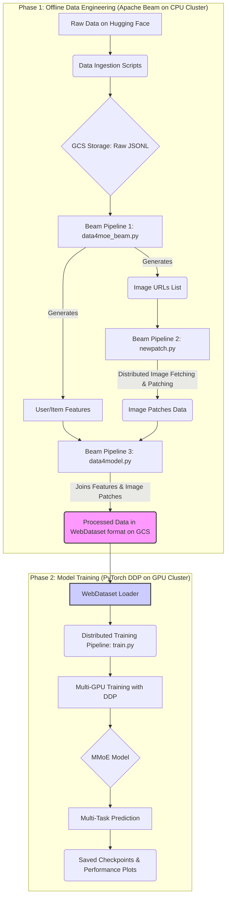

# End-to-End Multimodal Recommendation System

[](https://www.python.org/downloads/)
[](https://pytorch.org/)
[](https://beam.apache.org/)
[](https://opensource.org/licenses/MIT)

> 本项目是基于 Apache Beam 和 PyTorch DDP 构建的，从原始数据到模型训练的端到端多模态推荐系统。项目完整复现了工业界处理大规模推荐任务的标准范式，包括分布式特征工程、高效数据加载、复杂模型（MMoE）的分布式训练与微调。

---

## 核心特性

- **端到端全流程**: 覆盖从数据拉取、处理到模型训练的完整闭环。
- **工业级架构**: 特征工程与模型训练完全解耦，提高系统可扩展性。
- **高性能数据管道**: 使用 WebDataset 存储，解决云存储环境下的I/O瓶颈。
- **先进模型架构**: 实现复杂的多任务专家混合模型 (MMoE)。
- **高效分布式训练**: 使用 PyTorch DistributedDataParallel (DDP) 训练。

---

## 系统架构

本项目的核心设计思想是将整个推荐流程拆分为两个独立但衔接的阶段：**离线特征工程** 和 **模型训练**。



---

## 特征工程效果展示

以下是一个从Beam流水线中生成的真实用户画像样本：

```json
{
  "user_id": "USER_EXAMPLE_ID",
  "user_feat": {
    "cat_hist": {
      "All Electronics": 0.14,
      "Tools & Home Improvement": 0.43,
      "Sports & Outdoors": 0.14
    },
    "review_cnt": 7,
    "price_mean": 25.59,
    "price_std": 25.5,
    "history": [
      {
        "title": "Do not buy...did not work, will not hold a charge.",
        "text": "Purchased in Dec, first charge to full capacity before use mid January in Makita charger that came with drill. Neither battery held a sufficient charge to be useful..."
      },
      {
        "title": "20 amp 250v plug",
        "text": "Sometimes hard to find this 20 amp 250v plug was just what ai needed and I found it on Amazon. Superior Electric had it to me in good time at a fair price."
      }
    ]
  }
}
```

### 亮点解读 (Key Insights)

- **为句级交叉注意力赋能**: 特征工程中有意识地将用户多条历史评论整合成完整文本段落。
- **精准分句作为桥梁**: 模型训练预处理阶段精准切分文本段落成句子，实现细粒度语义理解。
- **实现深度语义交互**: 句向量序列被送入交叉注意力模块，实现用户历史兴趣和物品描述间的深度语义交互。

---
## 项目结构

```text
.
├── data4moe_beam.py     # 主特征工程脚本 (Beam)，生成用户/物品特征和图片URL列表
├── newpatch.py          # 分布式图片处理脚本 (Beam)，将URL转换为图像patch数据
├── data4model.py        # 合并所有特征并生成WebDataset的脚本 (Beam)
├── meta2gcs.py          # 从Hugging Face下载元数据的辅助脚本
├── review2gcs.py        # 从Hugging Face下载评论数据的辅助脚本
├── model.py             # 定义所有PyTorch模型架构 (MMoE, Experts)
├── train.py             # 核心模型训练脚本 (PyTorch DDP)
├── requirements.txt     # 项目依赖
└── README.md            # 本文档
```
---
## 环境安装

```shell
git clone [你的仓库URL]
cd [你的仓库目录]

conda create -n mmoe_rec python=3.11
conda activate mmoe_rec

pip install -r requirements.txt

python -c "import nltk; nltk.download('punkt'); nltk.download('punkt_tab')"
```

---

## 如何运行

### 数据准备

```shell
python meta2gcs.py --bucket [你的GCS桶名称]
python review2gcs.py --bucket [你的GCS桶名称]

python data4moe_beam.py --[相关参数]
python newpatch.py --[相关参数]
python data4model.py --output_dir gs://[你的GCS路径]
```

### 模型训练

```shell
export TOKENIZERS_PARALLELISM=false

torchrun --nproc_per_node=2 train.py \
  --model_name BAAI/bge-base-en-v1.5 \
  --img_model google/vit-base-patch16-224-in21k \
  --data_pattern '/path/to/your/local/wds_shards/data-*-*.tar.gz' \
  --batch_size 128 \
  --grad_accum 8 \
  --epochs 4 \
  --num_workers 32 \
  --lora_r 8 \
  --lr 1e-5 \
  --output_dir /workspace/outputs
```

---

## 性能优化与成果

- **解决I/O瓶颈**: 早期实验发现，直接从GCS流式读取数据导致严重的I/O瓶颈，GPU利用率极低。通过将数据预先下载到本地磁盘，彻底解决了该问题。
- **优化CPU预处理**: spaCy分词器成为新的CPU瓶颈。通过替换为轻量级的NLTK分词器，数据预处理速度提升了超过50倍，显著提高了GPU的平均利用率。
- **精细化显存管理**: 在LoRA微调解冻时遇到了反复的CUDA OOM问题。通过系统性地下调batch_size、增加梯度累积步数、限制max_tok，最终找到了一个可以在80GB显存内稳定运行的最佳配置，实现了高达91%的显存利用率。


---


## 未来工作方向

- **离线特征预处理**: 将分词和Tokenizer编码等CPU密集型任务完全离线化，将最终的Token ID存为二进制文件，进一步压榨数据加载性能，让GPU利用率达到极致。
- **流式处理**: 将Beam流水线从批处理模式切换到流处理模式，对接实时用户行为数据流（如Kafka），实现准实时的特征更新和模型训练。
- **模型架构探索**: 尝试更复杂的交叉注意力结构，以更好地捕捉多模态特征间的细粒度交互; 在MMoE中引入稀疏门控机制（Top-K Gating）。受到近期前沿研究（如DeepSeek-V2的LFBias）的启发，未来可以探索更先进的负载均衡策略，以确保稀疏门控下各个专家的均衡利用，防止模型退化。

---